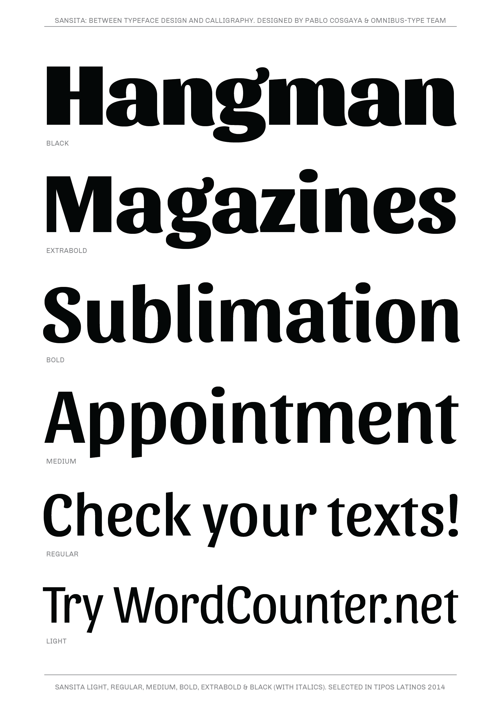
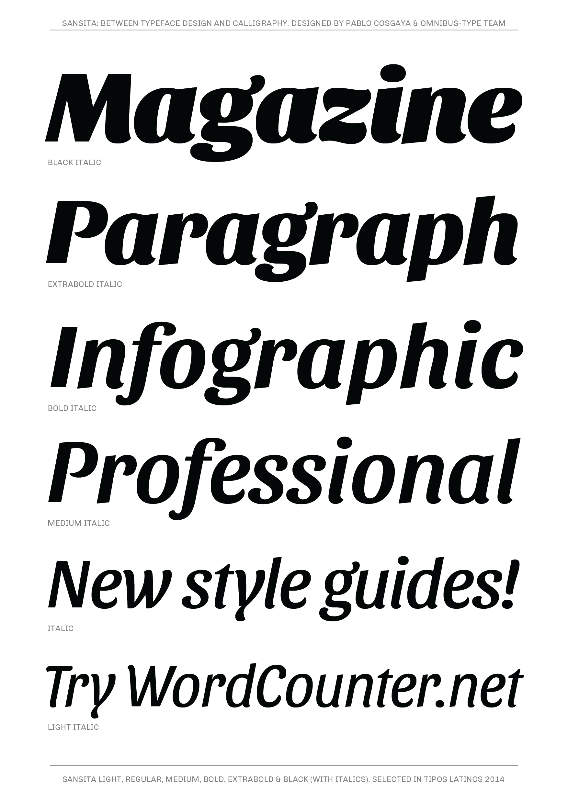

# Sansita family

**Omnibus-Type**  
*SIL Open Font License, 1.1*

Sansita is a tasty new [Omnibus Type](http://omnibus-type.com/) font designed by Pablo Cosgaya. The flavor of Sansita's lowercase explores the relationship between typography and calligraphy. The elegance of Sansita's uppercase makes this an excellent choice for packaging, brief texts, branding and slogans.

#### Sansita Family contains:
* regular/italic
* bold/bolditalic
* extrabold/extrabolditalic
* black/blackitalic

To contribute to the project contact [Omnibus Type](http://omnibus-type.com/).

### Designers

* Pablo Cosgaya
* Ana Sanfelippo [*Assistant designer*]

### License

Copyright (c) 2019, Omnibus-Type (www.omnibus-type.com | omnibus.type@gmail.com)

Licensed under the [*SIL Open Font License, 1.1*](http://scripts.sil.org/OFL); you may not use this file except in compliance with the License.

======
## FONTLOG for the Sansita fonts

This file provides detailed information on the Sansita and Sansita One font software.  
This information should be distributed along with the Sansita fonts and any derivative works.

### Basic Font Information

Sansita and Sansita One was designed to be used simultaneously in print and digital platforms. The technical and aesthetic characteristics of the font are both crafted for high performance typography.

### Sansita is a typeface family that supports Unicode language range: 

* Basic Latin 			U+0020-U+007E
* Latin-1 Supplement 		U+00A0-U+00FF
* Latin Extended-A 		U+0100-U+017F

**Character map to support MS Codepages:**
* 1252 Latin-1
* 1250 Latin-2 (Easter Europe)
* 1254 Turkish
* 1257 Windows Baltic
* Mac Roman

*To contribute to the project contact Omnibus-Type at omnibus.type@gmail.com*

**31 October 2018 (Omnibus-Type) Sansita v1.006**  
- Updated to GF Latin Plus set
- Supports 219 Latin languages used in 212 countries

**28 January 2015 (Omnibus-Type) Sansita v1.005**  
- Removed Reserve Font Name from the license
- Name tables adjusted
- fsType Installable Mode
- Set Panose values
- Updates CFF and TTF hinting
- Added Family Alignment Zones

**27 Dec 2013 (Omnibus-Type) Sansita v1.004.**
- Expanded in order to support Adobe Latin 3
- Improved CFF hint (AFDK Autohint 2.4)
- Updating hinting with ttfautohint (v0.97)

**17 Dec 2012 (Omnibus-Type) Sansita v1.003.**
Initial released as 'Sansita family'
- This release supports the following Unicode ranges:

Block              | Range
-------------------|--------------
Basic Latin        | U+0020-U+007E
Latin-1 Supplement | U+00A0-U+00FF
Latin Extended-A   | U+0100-U+017F

- Character map to support MS Codepages:
  - 1252 Latin-1
  - 1250 Latin-2 (Easter Europe)
  - 1254 Turkish
  - 1257 Windows Baltic
  - Mac Roman
- Improved CFF hint (AFDK Autohint 2.4)
- Fixed TTF table names
- Improved horizontal and vertical metrics
- Improved kerning
- Updated and expanded features in OT Tables:
  - GSUB:
    * **aalt** Access All Alternatives
    * **locl** Localized Forms
    * **sups** SuperScript
    * **frac** Diagonal Fractions
    * **ordn** Ordinals
    * **calt** Contextual Alternatives
    * **liga** Standar Ligatures
    * **ss01** Style Set 1
    * **salt** Stylistic Alternatives
      * Single Substitution
      * Ligature Substitution
  - GPOS:
    * **cpsp** Capital Spacing

**07 Sept 2011 (Pablo Cosgaya & Igino Marini) Sansita v1.001.**
- Initial Release as 'Sansita One'

### Acknowledgements

If you make modifications be sure to add your name (N), email (E), web-address
(if you have one) (W) and description (D). This list is in alphabetical order.

**N:** **Ana Sanfelippo**  
**E:** omnibus.type@gmail.com  
**W:** http://www.omnibus-type.com  
**D:** Assistant designer of Sansita family  

**N:** **Igino Marini**  
**E:** mail@iginomarini.com  
**W:** http://www.ikern.com  
**D:** Spacing and Kerning  

**N:** **Nicolás Silva**  
**E:** omnibus.type@gmail.com  
**W:** http://www.omnibus-type.com  
**D:** Typeface development  

**N:** **Pablo Cosgaya**  
**E:** omnibus.type@gmail.com  
**W:** http://www.omnibus-type.com  
**D:** Designer
